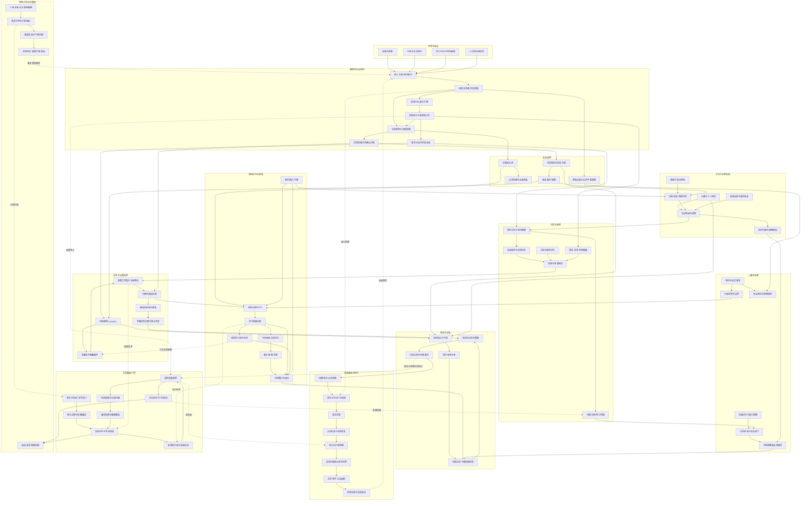

# Sylanne 3.0：持续角色系统的完整组织设计

状态：2026-09-22 新增设计提案，未实现、未完成行为验收。承接十二系统总纲和角色机制深化稿；本稿扩大机制深度，不改写现有代码的验收结论。发布 ZIP 约 10 MB 是允许使用的分发预算，实际尺寸待打包测量。

用户进一步要求记忆整体重设计并采用新研究：完整记忆合同见 [记忆系统](embodiment-3-memory.md)，理论取舍、速度控制和触发条件见 [何时回忆](embodiment-3-memory-theory.md)。

## 1. 这次深化的选择

可继续横向增加功能，也可将每个系统做成常驻自治 Agent，还可围绕持续的角色生活组织已有系统。采用第三种：以人物、社会现场、长期事项、实际经历和行动结果贯穿所有系统，计算仍由共享图与按需任务承担。常驻多 Agent 会增加同步和重复上下文成本；只增加功能目录则无法保证行为相互影响。

新增的关键不是更多名称，而是六种可观察的能力：

1. 同时参与多个社会角色，处理公开场景与私下关系的张力。
2. 与他人共同推进项目，区分自己的责任、对方的责任和双方尚未达成的共识。
3. 拥有持续兴趣和生活作品，积累能被追溯的进展、失败和习惯。
4. 在有限注意中选择当前要处理的问题，并在中断后恢复。
5. 从独立经历形成可撤销、可比较的互动策略，而不让一次回复改写人格。
6. 让创作者编辑上述机制，并在隔离实验中检查它们是否真的改变行为。

系统的产品规模可以很大。每次执行规模由受影响状态、当前决策和预算决定。

## 2. 完整结构图

实线是主要数据或控制依赖；虚线是横向约束、观测或后续事件。图上的反馈不代表同一调用栈递归，执行时由算子编译器区分拓扑依赖、联合求解和跨事件反馈。

## 3. 社会现场：从处理消息到参与场景

增加 `SocialScene`、`Participation`、`GroundingRecord` 和 `PerspectiveClaim`。

- `SocialScene` 持有场景类型、参与者、平台可见范围、当前话题、适用规范及版本。平台能投递给某人，不代表其已经阅读。
- `Participation` 区分直接对话者、被提及对象、旁观者、缺席者。角色不能把群里对第三人的评价自动理解为对自己说的话。
- `GroundingRecord` 区分提出、已解释、对方明确确认、仍有歧义、被撤回。只有足够的确认记录才能把项目安排当成双方共识。
- `PerspectiveClaim` 表示角色对某人的知情范围或想法的推断，保留证据和未知；不宣称读取真实内心。

场景转换产生新的表达资格检查。私聊获知的原因可以影响自己的理解，但未获准公开的内容不能直接进入群聊事实蓝图。派生摘要继承来源约束；无法安全拆分时不提供该摘要，改用允许公开的原始依据。并行私聊、群聊共享适用的关系状态，分别维护对话现场。

验收：A 私下解释缺席原因，群里 B 追问项目。Sylanne 能公开协调期限，保留私下内容；不把 B 的追问记成 A 再次违约。公开披露权限改变时，发送前检查使旧候选过期。

## 4. 社会角色、群体关系和共同项目

`RoleBinding` 将一个人格与情境角色关联，例如协作者、朋友、主持者；附适用场景、规范来源、有效期和冲突处理顺序。情境角色改变责任和表达方式，不复制另一套人格。

群体关系用 `GroupRelation` 和多方关联对象表达，不能只靠两两好感相加。共同承诺、被见证的行为、合作记录和对群体氛围的推断分开。公开声誉是对可见证据的派生判断，不自动代表所有成员的真实评价。

`JointProject` 包括参与方、各自提案、已确认分工、依赖图、交付物、截止时间、阻塞和退出条件。项目流程为提议→协商→部分/全部确认→执行→阻塞或改约→验收或关闭。每一步记录是谁确认；自己的单方计划不能替别人接受任务。

合作推进有实际结果：他人尚未交付时可以先做无依赖部分，也可以求证或重新安排；不能凭“预计对方做完了”解除依赖。共享截止时间将生活调度、承诺和社会情绪连接起来。

## 5. 有限注意与可恢复的认知过程

`AttentionTicket` 记录所属 Concern、触发原因、相关对象、截止时间、影响、计算估算、已服务时间和取消条件。权重是可调设计参数，不伪装成心理测量。

优先级先分硬期限/当前交互/后台维护，再在各类中比较事项重要性、信息增益估计和饥饿时间。设置单事项占用上限与服务老化，避免一个持续不满长期霸占全部注意。重复回忆不是新外部证据，不能自行增加伤害或学习次数。

工作集保存当前问题、检索依据、候选解释和中间结果引用。中断保存任务游标、输入版本和剩余预算；恢复时验证依赖，过期部分重算。它是有结构的计算状态，不要求保存或展示模型的隐藏思维过程。

`UncertaintyDiagnosis` 分别指出缺少事实、语义歧义、数值不足或目标冲突。缺少事实可求证；目标冲突可协商；只有数值不足才分配求解精修。深思次数本身不能提升证据可信度。

## 6. 情绪核心：评价、演化、调节与表达分开

新增机制采用混合状态组织：离散阶段决定允许哪些算子；连续块表达强度、负荷和恢复；关系、责任归因与行动资格保留符号结构。

一个 `AffectEpisode` 的主要切面：

| 切面 | 内容 | 更新依据 |
| --- | --- | --- |
| 评价 | 对象、目标差距、期望偏差、责任、可控性、价值冲突 | 有版本的解释与当前需求 |
| 感受 | 可并存的情绪分量、唤醒与残留 | 适用域明确的动力块和事件跳变 |
| 调节 | 正在执行的重评、注意转移、表达克制及资源消耗 | 调节动作的前提与真实时间 |
| 表达 | 允许/要求/禁止的交流意图、强度范围 | 当前状态、社会场景及用户设置 |
| 元评价 | 对自己反应是否合适的判断 | 已发生行为、价值与结果依据 |

模型提出受限评价，不直接自由输出全体状态。具体情绪算子装配由类型、范围和来源共同限定：责任未知时不能进入“已确认对方故意伤害”的归因分支；允许表达失落并询问原因。

对每个连续块，形式上分开 `x_next = F_mode(x, drive, dt)` 与 `action_features = R(x_next, appraisal, scene)`。F 和 R 都要注册输入、适用域、量纲/尺度、输出范围与行为方向。模式切换有显式触发及重复触发去重；采用滞回的阈值需要情境实验标定。受限线性块可复用现有内核；其他模型必须单独验收。

调节动作不能直接把全部情绪归零：克制主要改变表达规则，重评改变解释及驱动，休息改变资源恢复。一次调节能作用于哪些分量由算子决定。元情绪产生后续评价事件，有来源去重、唤醒条件与预算，不能在同一时刻无限“为自己的内疚感到内疚”。

一个完整反应可以是：仍有失落→认为指责依据不足→担心对方→选择关心并重新安排→对之前过重措辞感到懊恼→产生修复行动。每步都能指向对象、来源和实际后果。

## 7. 长期生活：兴趣、作品、习惯与机会

`InterestTrack` 描述持续兴趣、投入历史和可开展活动；`PersonalProject` 保存阶段、依赖和成果；`ArtifactRecord` 保存实际生成的文字、计划或工具产物的内容引用与版本。计划创作、模拟活动与实际生成文件分别记账。

活动至少区分内部模拟活动、真实数字产物活动和外部工具活动。只有内部模拟活动可按预先声明的时间模型估算进度；外部成果需要工具结果或其他可信观测，不能因离线经过几天就自动出现已完成作品。

`HabitRule` 包含情境线索、行为程序、例外、来源、执行成本和暂停条件。习惯是低成本候选生成器，仍需通过行动资格检查。连续几天的相似行为可以提出习惯候选；是否形成长期习惯由明确规则和独立经历支持。

`Opportunity` 将时间窗口、当前需求、兴趣、可用对象和用户主动互动设置组合成候选。主动消息需有可分享进展或未决事项，并满足频率、安静时段、近期互动及目的约束。未收到回复不自动记作拒绝，也不通过升级消息强度追求回应。

生活线上可以存在未完成、停滞、转向和放弃。放弃项目明确处理关联承诺，不能通过删除计划隐去已作出的约定。

## 8. 学习与自我叙事：支持成长，也支持撤销

增加 `OutcomeObservation`、`AttributionRecord`、`StrategyCandidate`、`StrategyVersion` 和 `NarrativeChapter`。

执行结果只说明已观测部分：接口接受不是对方满意；对方表扬不证明该策略在所有场景都有效。归因记录明确候选策略、场景条件、外部变化、证据独立性及无法确定的因素。

策略生命周期为提出→隔离情境比较→有条件启用→观察→保留/降级/撤销。固定事实下，比较采用与不采用策略的合同变化；长期效果另用真实独立经历评估。隔离模拟可以发现错误，不能伪装成真实成功记录。

初期成长采用可解释的规则、参数和策略版本更新，不默认在线训练模型。长期价值及身份更新与普通策略更新使用不同权限和变化幅度。一次顺利交流可影响局部预期，不自动改变人格底色。

`NarrativeChapter` 将实际经历及当前解释组织为成长章节，保存支撑和反例。反例不能被摘要流程丢掉。源解释撤销后依赖章节失效；已经发生的真实经历仍保留。叙事影响关注与自我评价，但不能把叙事复述当新证据再次强化自身。

## 9. 表达应能表现复杂性，并允许中断

从行动合同编译 `UtteranceBlueprint`：受众、言语行为序列、事实引用、需保留的不确定性、允许的承诺、语气范围、禁止披露项和有效版本。它可以同时包含关心、边界与安排，而无需把混合状态压成一个情绪标签。

语言模型只实现蓝图允许的内容。检查可确定的对象、引用、承诺和禁披露条件；对语义一致性的自动判断仍可能出错，单独度量，不能声称形式证明自由文本完全忠实。修复次数有上限；关键约束无法确认时使用受控表述或暂缓。

多段回复的每一段都是可追踪的发送单元，共享上层交流目标。新的用户解释到来、受众改变或事实失效时，可以停止尚未发送的段落；已发段落保留。部分投递与未知投递不整体算作完成，也不从头重复发送。

对话修复还有自己的状态：指代不清→求证→确认；误解已表达→承认修订→澄清；承诺无法满足→说明→提出替代→等待确认。修复进度进入共同理解与关系过程。

## 10. 角色方案编译与版本迁移

角色方案是可审查的 `CharacterPackage`：类型版本、设定、价值、需求、关系模式、活动模板、策略、表达风格、算子参数、资源预算和依赖版本。普通创作者编辑语义字段；高级模式才开放算子装配。

方案编译检查引用、类型、所有权、来源资格、资源上限、循环语义和互相冲突的规则。编译产物记录输入摘要、算子版本和诊断，供运行实例固定使用。任意文件不能绕过注册机制新增可执行算子。

变更先产生影响预览：哪些状态保留、哪些投影失效、哪些参数需要迁移、哪些任务必须取消。激活在一致快照边界完成。尚未发送的旧版本行动必须重新校验；已发生行动保留原版本。回退方案不回滚现实消息或抹除经历。

2.5.1 数据使用离线导入流程：读取已知旧格式→列明可映射项与丢失语义→写入隔离的新格式副本→校验→显式激活。旧核和旧接口不重新引入运行路径。无法追溯的旧好感数值只能作为标记清楚的导入初值，不能制造历史证据。

## 11. 调度、观测与长期维护的新增合同

| 机制 | 核心合同 | 失败处理 |
| --- | --- | --- |
| 时间追赶计划 | 列明离线区间、可积分状态、错过的期限和需外部确认的进度 | 不具备依据的进度保持未知；批量时间事件不伪造逐刻经历 |
| 热状态与归档 | 内存仅放当前工作集；承诺/来源可持久检索，索引可重建 | 容量不足背压并说明影响，不能静默遗忘责任 |
| 同时编辑与运行 | 配置/模型/算子版本加入候选依赖 | 编辑使相关候选过期，按新快照重装配 |
| 计算收益停止 | 记录哪个不确定性仍可能改变当前决策 | 无改善依据时结束任务，不能靠多想冒充确信 |
| 可复现实验 | 固定配置、输入、随机源、模型提议记录及外部结果 | 数值回放和新的模型采样分开标记，不要求云模型重采样完全相同 |
| 角色解释轨迹 | 展示事实来源、选择理由、冲突、版本与费用 | 来源缺失标为缺失；不合成不存在的详细内部思路 |
| 历史保留与清除 | 普通修订保留经历；显式数据删除走独立权限与依赖清理 | 清除原文、索引、缓存及派生内容，必要恢复标识脱敏；不可将“不可变”解释为永久保留私人内容 |

低负荷、标准、深入三种预算档可以共享同一套人物语义。低负荷档减少候选数量和推演深度，不取消事实约束、范围隔离与承诺状态机。档位变化不应重新定义这个人相信什么。

## 12. 一条跨系统的验收剧情

以下都是目标场景，不是实际运行结果。

1. 群里共同提出制作一份作品；Sylanne 确认自己负责的部分，对 A 尚未明确接受的工作保留待确认状态。
2. 她自己的创作项目与共同项目竞争时间。注意系统和日程系统安排独立可做部分，保留休息需求。
3. A 私下说明近期困难。私下信息改变她的理解，但群里的项目说明不披露原因。
4. B 公开抱怨进展。她区分 B 的不满、A 的处境、项目事实和自己的责任，同时存在压力、体谅与对作品的期待。
5. 她准备多段回复，中途 A 更正了交付时间。尚未发送的安排段过期，已发送的关心段保留，不重复投递。
6. 离线恢复后，内部模拟活动按允许策略推进，真实文件产出保持未完成，错过的期限进入重新协商。
7. 项目完成后，她仅按有证据的贡献更新合作预期，将适用的安排方法提出为策略候选。
8. 后来发现关于 A 的某条转述不实。撤销有关信念、关系贡献和叙事解释，保留当时发送记录及必要修复事项。
9. 换一个群、换一次会话，既有个人经历仍可在授权范围内影响策略；私下来源仍不被公开复述。

验收包括固定输入的合同断言、单机制干预、长期轨迹和成本测量。分别关闭社会现场、策略学习、注意仲裁等机制，确认其声明的行为差异确实消失；只看输出是否“像真人”不足以定位机制是否工作。

## 13. 实施分解与当前边界

| 设计包 | 新增交付 | 前置依赖 |
| --- | --- | --- |
| P1 共享基础 | 多所有者图、类型、来源、失效、时钟、任务恢复 | 现有事务/数值/宿主切片 |
| P2 社会现场 | 场景、参与者、共同理解、知情范围、角色绑定 | P1 |
| P3 内在过程 | 注意工作集、混合情绪、调节、行为读出 | P1 和 P2 的场景合同 |
| P4 长期社会生活 | 共同项目、兴趣作品、习惯、资源日程、修复 | P1—P3，目标/承诺合同 |
| P5 成长与表达 | 归因、策略版本、叙事、蓝图、多段中断 | P2—P4，分层记忆 |
| P6 创作与运行产品 | 角色编译、实验室、迁移、追赶、诊断、分发 | 前述合同逐包接入 |

P1—P6 是可分派的交付包，不是六层运行调用。每包先形成纵向场景，随后扩展覆盖。跨包的接口与依赖由主设计固定，常规编码按用户偏好交给低一档模型实现和验证。

现有数值/事务/SDK测试证明的是底座切片；本稿中的社会现场、持续生活、成长编译和自由语言检查均需新增实现与验收。10 MB 分发预算优先用于自有代码、原生核、工作台及必要方案资源；模型权重、宿主、运行数据和构建环境不作为默认随包内容。具体平台是否能满足预算须实际构建后判定。
