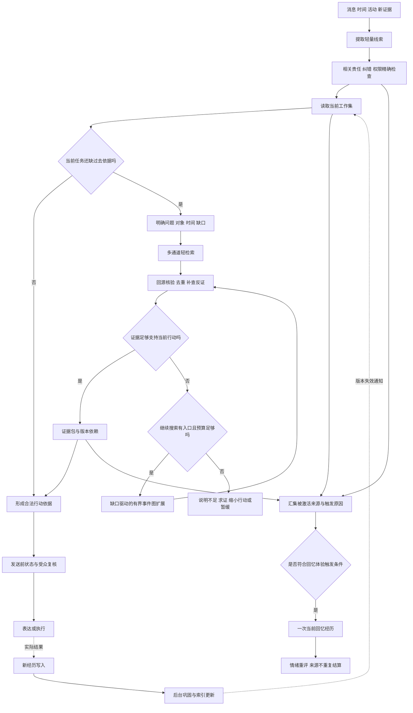

# Sylanne 3.0：事件记忆、回忆触发与计算预算

状态：2026-09-22 研究后的设计提案，尚未实现或测得性能。本稿是 `embodiment-3-memory.md` 的机制补充；明确回答用户的“用新的理论”“又快又好”“什么时候回忆”。下述组合是面向 Sylanne 的工程设计假设，不是一篇已经被验证的新认知理论。

## 1. 研究选择及适用边界

| 一手研究 | 取用的思想 | 在 Sylanne 中的改造 |
| --- | --- | --- |
| [CompassMem，2026](https://arxiv.org/html/2601.04726v1) | 以事件及其逻辑关系组织经历，沿问题缺口寻找证据 | 采用事件表示；常规路径使用有界本地图搜索，不逐节点调用多个模型。论文附录表 4 的特定实验平均每问 20.87 秒，不能直接作为聊天响应方案或本插件性能预测 |
| [Hindsight，2025](https://arxiv.org/html/2512.12818v1) | 区分世界信息、主体经历、摘要和信念；按预算融合多种检索 | 复用共享存储，加入来源撤销、角色行为合同及受众约束；不引入其整套服务作为默认依赖 |
| [HippoRAG 2，2025](https://arxiv.org/html/2502.14802v1) | 联合段落上下文与关联图进行检索 | 保留原文入口，图关联辅助补全，避免只抽三元组丢失语境；相关路径不冒充因果证明 |
| [A-MEM，2025](https://arxiv.org/abs/2502.12110) | 记忆之间的连接和组织可以随新经历演化 | 后台版本化维护关联与解释，普通回忆不任意改写历史记录 |
| [Titans](https://arxiv.org/abs/2501.00663)、[Engram，2026](https://arxiv.org/abs/2601.07372) | 分别研究模型内部神经记忆与条件查表记忆 | 属于模型架构研究。插件可借鉴选择性记忆、将可查询信息与昂贵计算分开，但不能靠换一个数据库声称实现这些架构 |

论文支持的是各自在特定任务与实验条件下的结果。本方案仍需同模型、同输入、同预算的本地比较；不继承论文准确率，也不把事件图等同于已经理解因果。

## 2. 推荐的中心机制

采用“事件组织 + 当前可用工作集 + 按需要回忆 + 后台经验整合”。它们是同一存储上的四种过程，没有逐层递归要求。

### 2.1 把事件保存成结构，而不是只保存句子

事件模式包含：主体、行为、对象、时间、场景、当时目标、当时已知条件、预期、实际结果、尚未解决的问题，以及原始证据引用。字段允许未知，禁止补故事凑齐。

关联边区分同一对象、前后时序、计划依赖、证据支持、反证、解释修订和推测的因果。模型提出的原因保留推断标签；动作先于结果不足以证明原因。

分段依据活动转换、目标/参与者变化及新结果；检测到预期不符可以提出新边界。初始版本使用可解释规则和现有语义提议，不为每条消息单独部署一个预测网络。边界判断错误允许重新组织 Episode，不改变来源去重。

### 2.2 快速保存，慢速形成经验

新经历首先保持具体：这次发生了什么、与谁有关。只有多个独立实例和反例共同支持时，才形成适用范围明确的偏好、习惯或策略候选。

后台可以更仔细地整理一次经历，使以后读取便宜。整理成本必须计入每天总费用，不因为移出前台就当作免费。未完成承诺、明确纠错等关键项直接进入权威状态，不能等摘要完成才可查询。

### 2.3 回忆重建证据包，不能自由重建事实

回忆从事件、原文、当前解释和相关责任装配本次任务所需的证据。相同经历可以在不同问题下呈现不同侧面，但事实引用、当时/现在的区别及不确定性必须保留。

### 2.4 稳定信息预先建立入口

当前对象、项目、承诺、明确偏好和活跃 Concern 建立精确访问入口。频繁使用的合法证据包可版本化缓存；无需每次让模型重新从整段历史中“推理出”用户是谁、项目进行到哪一步。

这属于插件层的查询与缓存设计，不是 Engram 的模型内查表实现。

工作集有明确生命周期：当前事项、当前对象和合格回忆结果可以进入；闲置或超出内存预算时移出；纠错、删除、权限或对象切换使相关引用失效。它保存源版本、权限版本和查询域代际，读取时检查当前提交代际，不能只等待可能延迟的失效通知。热内容淘汰不删除持久化责任；关键责任从权威精确查询重新取得。初始容量按引用数和内容 token 双重限制，超量先丢可重建缓存，具体默认值在基线测量后确定。

## 3. 什么时候回忆：触发合同

每次外界事件先经过轻量触发判断。判断本身只访问当前工作集及必要索引，不默认调用生成模型，不扫描全部历史。

| 触发 | 例子 | 具体动作 | 是否可因普通收益评分跳过 |
| --- | --- | --- | --- |
| 明确请求过去信息 | “我们上次约了什么？” | 查对象/事项/时间；不足再扩展事件图 | 不可悄悄跳过；无证据应说明 |
| 指代或上下文缺口 | “那件事后来怎么样？” | 工作集解析；缺失时查相关活跃项目 | 可先询问是哪件事，不能乱补 |
| 新旧冲突与明确纠错 | “上次说错了，时间是周四” | 精确定位源与当前版本，启动修订 | 不可跳过相关核查 |
| 准备作出或执行承诺 | 准备答应今晚交付 | 精确查日程、未完成责任、边界和历史执行状态 | 必查，不依赖语义相似度 |
| 当前任务需要过去依据 | 决定怎样修复同一分歧 | 按 Concern/关系领域召回支持与反证 | 依据已足够可停止 |
| 当前线索唤起相关经历 | 再次提到共同完成的作品 | 轻量定位事件；合格时形成 RecallEvent | 可限额；无需回忆所有相似往事 |
| 期限或活动状态到达 | 约定时间临近、项目结果返回 | 唤醒绑定的责任/事项，读取精确记录 | 必查状态；发消息仍需行动资格 |
| 互动阶段结束或空闲维护 | 一个项目阶段收尾 | 后台巩固与解释整理 | 可暂停，不自动产生对外回复 |
| 普通问候且无相关事项 | “早呀” | 使用合法当前工作集与表达偏好 | 通常不启动历史搜索 |

查到历史不代表必须在回复中提起历史。是否表达取决于当前交流意图、受众及行动合同。很多回忆只用于避免重复问、避免违约和选择更合适的措辞。

工作集命中、精确查询和深检索统一输出被激活的来源引用；是否形成主观回忆经历由独立的触发合同判断。共同作品直接唤起热工作集中的经历也可以产生一次 RecallEvent，后台承诺核查则只是读数据。不能把“执行过数据库检索”作为“产生了回忆体验”的充分或必要条件。

角色的主动性也有两种：环境/时间/活动线索触发相关经历；低优先级的生活反思任务选择一个有来源的问题。二者都要受用户主动互动设置、注意预算和安静时段约束；后台联想没有自动发消息权限。

## 4. 从触发到结束的状态机

`CueDetected -> ObligationsChecked -> WorkingSetChecked -> SearchNeeded -> EvidenceChecked -> Ready | Clarify | Insufficient | Deferred`

`SearchNeeded` 内部可选择轻检索或深检索，不要求每个任务先走所有档位。明确复杂历史问题可以直接申请深检索；普通词法命中也不能免除冲突、来源和当前版本检查。

`RecallRequest` 包含触发原因、对象/事项、待回答的事实槽位、时间视角、必查责任、受众和处理权限、输入版本、前台截止时间、模型/CPU/token预算、去重键及停止条件。

区分可选历史探索与执行必需的核查。必查核查失败时，不执行依赖该事实的行动；可以说明不确定、缩小承诺或求证。它不会被“用户可能不喜欢等待”的分数抵消。

## 5. 三档回忆，复杂度按问题分配

以下数字是开发期初始上限，不是实测最优值或性能承诺。辅助生成模型调用不包含最终回复；嵌入和重排调用分别计费、计时。

| 档位 | 工作内容 | 初始计算约束 |
| --- | --- | --- |
| 当前可用记忆 | 工作集与明确键查询、相关责任核查 | 0 次辅助生成调用；查询范围受当前对象/事项约束 |
| 常规回忆 | 词法/实体/时间/可选向量召回，合并去重和局部关联补齐 | 0 次辅助生成调用；各通道最多 32 个初始候选，融合后最多 64 个；初始图扩展上限 2 跳/128 节点 |
| 深度回忆 | 按证据缺口改写查询、追踪跨事件关系、对照历史版本 | 默认最多 2 次辅助生成调用；复用已有候选，图节点和上下文另设总上限，耗尽则返回不足而非无限搜索 |

这些候选上限用于开放式语义召回，不能截断关键责任的精确查询。有关责任超过当前输出预算时分页或摘要列举引用并报告范围；无法完整核查的承诺不得直接接受。

深度回忆的辅助调用职责固定：第一次提出有结构的缺口与查询计划，第二次仅在首轮仍缺依据时修订计划或整理证据引用；最终自然语言回复走独立的表达合同。超时或格式失败消耗本次调用预算，不通过隐含重试突破上限。若必查触发类型无法确定，先进入有界精确核查，不能把分类不确定当成无需回忆。

图遍历首先限制所有权、受众、对象和时间，再按边类型设置扩展顺序。保留 visited 集及每来源家族上限，避免环和热门节点垄断。图命中必须回源，不能把 PageRank 或激活分数解释成真实性概率。

常规路径可以使用本地索引；远程嵌入/重排可选且有截止时间，不能使必查记录依赖远程服务。某一通道不可用时报告覆盖差异，复用其他通道，禁止伪造零向量。

## 6. 如何决定再多回忆一轮是否值得

设待解决问题为 q，已经取得证据为 E，下一步搜索动作为 a。我们的工程控制目标是：

`预计补齐决策所需证据的收益 - 延迟代价 - 调用费用 - 上下文干扰代价`

超过阈值才执行可选搜索。初始不假装拥有可校准的收益概率，使用明确条件近似：关键槽位未覆盖、支持与反证冲突、实体归属不明、历史版本不匹配，且存在尚未探索的相关入口。

判定证据“够用”的依据：必须回答的槽位有合法来源；关键时间/主体明确；已查询相关纠错及反例；关键责任已核查；当前行动不依赖仍未确认的推断。模型一句“我确信”不是停止证书，这些条件也不构成自然语言正确性的形式证明。

以下情况停止或转向求证：补充结果只有同源重复；两轮没有减少已列明的缺口；剩余信息在当前权限下不可用；来源确实缺失；预算或截止时间耗尽。时间耗尽只改变返回状态，不使答案自动变正确。

在拥有开发集后，再尝试轻量路由模型或收益估计；比较漏触发率和成本是否改善。路由训练与调参不得使用保留测试集。

## 7. 避免情绪驱动的回忆循环

唤起资格需要新的环境线索、事项状态变化、明确的反思调度或有意义的新解释。当前情绪升高可提高相关任务优先级，但不能单独无限创建 RecallRequest。

去重键包含来源家族、Concern、解释版本、触发类型及当前时间窗口。重复后台读取只是读取，不自动成为经历；确实触发的回忆可形成一次当前内部经历，但不会新增对方的外部责任或再次消费同一信任证据。

每个 Concern 设置回忆服务配额、冷却与恢复条件。新证据和明确用户提问可突破普通冷却，仍受总体预算约束。负面线索同时保留反证检索入口，避免反复检索塑造越来越偏的自传。

## 8. 让速度优化不损害正确性

1. **一次理解，多个消费者复用**：已有合法语义提议中的对象、时间和事项可服务记忆，不另起多套模型重新解析；依赖旧记忆才能理解的部分保留循环边界，不能用晚生成的结果满足先决条件。
2. **后台只重建脏对象**：新事件仅更新相关 Episode、实体、摘要与索引；不全量反思全部人格。
3. **缓存依赖不只记录已命中的行**：还记录查询域的变更代际、权限版本和索引水位。新增反证可能不在旧读集中，不能因旧行没改就继续复用旧答案。
4. **负结果也有有效期**：缓存“未找到”时绑定查询域代际与覆盖状态；新记录进入后失效。
5. **热工作集保持引用与版本**：内容可以预载，但在行动前必须复核权限与依赖；过期不是“有点旧也能先用”。
6. **编码保留原文入口**：提取遗漏不能使源消息从所有检索通道永久消失；低优先级原文召回作为补充。
7. **不把扩展全图当作默认深度**：先访问问题相关子图；不存在省略误差证明时，用覆盖诊断及对照实验衡量损失，不声称局部结果必然等于全库检索。

## 9. 回忆控制图

## 10. 怎样验证又快又好

采用同一底层模型和相同历史输入，对照：固定摘要 + 向量 top-k、混合检索、事件图 + 始终深检索、事件图 + 自适应触发。分别固定在线预算比较质量，并报告相同质量附近的总费用/延迟。入库、后台巩固、嵌入、重排和回答成本都纳入，不能只比较前台耗时。

公共测试参考 [LongMemEval](https://arxiv.org/abs/2410.10813) 的更新、时间、多会话与拒答能力；其作者的 [LongMemEval-V2](https://xiaowu0162.github.io/longmemeval-v2/) 提供进一步的长期 Agent 记忆评估方向。锁定所用版本、模型和评分口径，不混报不同榜单分数。另建 Sylanne 的人物/关系/承诺轨迹集。

特别增加“何时回忆”测试集，标注哪些轮次必须回忆、哪些轮次仅需精确责任查询、哪些可以直接使用当前工作集。指标包括漏触发率、无用触发率、错误提前停止、每轮辅助调用分布、关键责任覆盖和 P95 增量延迟。

初始正确性门槛：作用域越界、已删除内容复活、撤回证据继续作为当前依据、重复回忆新增外部责任等确定性用例全部通过。质量和延迟阈值在固定硬件及数据规模的基线测量后制定，不能现在声称已经毫秒级或全面超越旧版。

对关键机制做消融：关闭事件关系、关闭反证补查、取消触发路由、关闭后台整合。只有观察到各自预期的收益及代价，才保留对应复杂度。

## 11. 融入现有设计的决定

采用事件为主的记忆组织；在新记忆 API 中加入 RecallRequest、EvidenceGap、RecallTriggerPolicy 与查询域代际。当前可用记忆、常规回忆、深度回忆是按需模式。情绪、承诺、生活和表达通过同一个控制器请求回忆，不能各自启动无预算的检索链。

研究新颖性与工程适用性分别判断。先交付可解释触发与证据合同，再用测量决定是否引入学习路由、神经重排或更复杂的记忆压缩。这保留了重型系统的深度，也让简单交互保持短路径。
