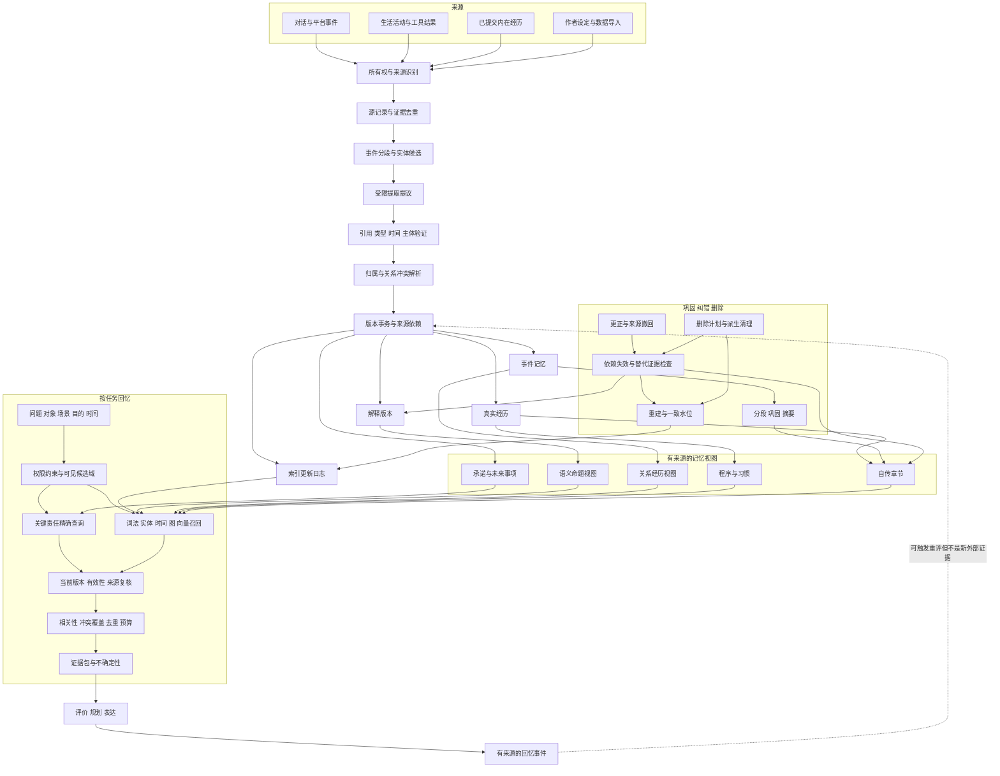

# Sylanne 3.0：记忆系统重设计

状态：2026-09-22 根据用户新增要求编写的设计提案。整体替换旧记忆运行接口及处理流程；尚未实现。本稿细化 `embodiment-3-ecosystem.md` 中的记忆、成长与信息边界，不另建第二套权威角色状态。

研究路线、回忆触发条件和分档计算合同见 [事件记忆与回忆控制](embodiment-3-memory-theory.md)。本稿定义存储与操作语义，该补充定义何时调用及怎样控制计算。

## 1. 记忆系统的职责

记忆需要回答六种不同问题：发生过什么，当时如何理解，现在如何理解，与谁有关，尚欠什么责任，这段经历改变了哪些做法。

不能把它们压进一段会不断覆盖的聊天摘要，也不能把向量库召回结果直接当作角色相信的事实。对这个产品，推荐“有来源的经历与修订记录 + 类型化记忆视图 + 按任务检索 + 可重建索引”。纯长上下文方案难以独立纠错和控制费用；纯向量召回难以保证承诺完整性、时间语义和作用域边界。向量检索可作为本方案的一个候选召回器。

记忆不是每轮聊天末尾才调用的存档模块。它同时服务情绪评价、关系修复、计划执行、生活活动、角色成长和语言表达。

## 2. 数据对象及权威归属

| 对象 | 保存什么 | 权威与更新规则 |
| --- | --- | --- |
| SourceRecord | 消息、作者设定、内部过程、工具结果及各自来源 | 原始输入记录，普通纠错不覆盖原文；显式删除按专门协议处理 |
| EvidenceUnit | 来源片段、涉及主体、发生/观察时间、引用和独立性链 | 最小可追溯证据单位；多个引用不形成多个独立经历 |
| Episode | 一段实际发生的交互或活动，起止与阶段、参与者、结果 | 有版本的事件组织；边界调整不复制源证据 |
| ExperienceRecord | 已真实提交的角色反应、所用解释、负荷和行为引用 | 真实运行经历账本，不写入未提交求解或模拟分支 |
| InterpretationRevision | 对同一证据的某一版本解释及适用时间 | 可新增、争议、撤销；保留当时与现在的区别 |
| BeliefState | 主体当前接受/保留/怀疑的命题及理由 | 信念系统拥有；记忆只提供访问视图，不复制真值 |
| RelationshipMemory | 与某对象相关的经历、修复和共同项目索引 | 关系与源记录的派生视图，不再保存一份好感值 |
| CommitmentView | 未完成承诺、期限、条件和来源引用 | 执行系统拥有；通过精确查询提供给记忆消费者 |
| ProcedureMemory | 在何种情境下可使用哪种习惯或策略 | 策略系统拥有版本；记忆负责来源和检索 |
| NarrativeChapter | 对一段成长史的当前概括、依据和反例 | 可失效的解释性投影，不作为新的事实来源 |
| RetrievalIndex | 文本、时间、实体、来源图和可选向量索引 | 可重建投影；不能绕过权威记录决定事实或权限 |

每个对象引用共享原子图的稳定标识与版本。不同视图可以分表、分索引，但只有一个明确的可写所有者。检索系统不会因为“记住一次承诺”而另外创建一个不同步的承诺状态机。

EvidenceUnit 显式记录 `provenance_root`、传播/引用链及独立性状态：已知同源、具有独立采集依据、关系未知。不同消息 ID 或不同发言者不足以证明来源独立；两个工具结果也可能来自同一上游记录。关系未知的证据可供比较，不直接累计为完整的独立学习次数。原帖、十次转发和引用它的摘要属于同一来源家族；独立性判断后来变化时也会使相关学习贡献失效。

## 3. 所有权、来源与时间分别建模

所有权至少包括租户/Bot、人格、关系对象、场景与活动。涉及对象是“记忆在说谁”，不等于“谁可以读”。平台账户映射到统一对象必须有明确来源，不能因同名自动合并。

每条证据保留四个互不替代的字段组：

1. **出处**：直接观测、他人陈述、作者设定、内部过程、模型解释、模拟结果。
2. **断言状态**：已确认、转述、争议、未知、撤回；收到某句陈述可以已确认，其陈述内容仍可未知。
3. **时间**：事件发生时间/区间、内容所述有效时间/区间、系统接收时间、当前记录版本的提交时间；未知时间保留未知。
4. **使用边界**：所属人格、允许处理目的、允许进入的模型调用、允许表达的受众、保留规则及授权版本。

用户周五说“周一我出差了”：接收时间是周五，所述事件时间是周一。后来更正成周二，新增解释版本。历史查询“周三时角色知道什么”不能读取周五才收到的信息。

“现在不喝咖啡”可能是偏好变更，“上次说错了，我一直不喝”可能是对旧陈述的修正，“朋友说他不喝”则是不同视角。冲突检测先区分主体、有效时间、语境和来源，再决定并存、覆盖适用区间、争议或撤销；不能统一保留最新一句。

## 4. 记忆写入流程

### 4.1 原始记录与长期记忆不等同

去重后的消息按保留策略进入源记录，不要求每条消息都调用一次模型制作长期记忆。已知的承诺、工具结果和活动状态优先使用结构化输入。普通寒暄可以只保留短期现场；涉及更正、计划、明确偏好或持续事项时才形成相应长期对象。

一个来源可拆出多个命题，但共享来源根。引用片段证明命题有对应文本，不能独自证明提取语义正确。提取器只提出有类型的候选，不直接写入已确认事实或学习权重。

### 4.2 事件分段

按活动、参与者、主题转换和显式结束条件形成 Episode；时间窗口仅作辅助。一次对话可以涉及多个事件，同一项目也可以跨多次对话。合并/拆分只调整组织边界，保留原来源标识及贡献记录。

模糊实体映射保留候选，暂不合并人物。图合并操作生成可追踪映射版本；发现误合并时可恢复所有原始归属，重建派生视图。

### 4.3 同步写入与后台巩固

当前行为所依赖的源记录、解释、状态及行动意图采用相关事务合同。必须先持久化将来追责或恢复所需的引用，再允许外部行动。词法/向量索引、摘要、自传巩固可以异步完成。

索引更新日志与权威变更同事务提交，后台消费具备幂等键与进度水位。崩溃恢复后重放未完成更新，不靠“应该已经建索引了”的内存标志。

## 5. 回忆是一种任务，而不是固定 top-k

`MemoryQuery` 明确：发起任务、人格和对象范围、当前场景与受众、使用目的、目标时间、查询历史还是现在、必须包含的责任、可用字数/时间预算及权限版本。

检索有三条并行来源：

- **关键项精确查询**：当前有关的未完成承诺、明确边界、正在纠正的来源、已执行行动、当前项目阻塞。不能因相似度低而缺席。
- **语义候选查询**：词法、实体与时间过滤、来源图邻接和可选向量召回。不同召回分数只作各自排序信号，不合并成事实可信度。
- **竞争证据查询**：对关键候选补查有效反例、替代解释、撤回与更新版本，避免只找到符合当前情绪的经历。

先限定可访问对象域，再召回；候选进入模型前重新验证当前权限、版本、来源、时间与有效性。受限来源不进入外部重排或嵌入调用。对内部允许使用但不能披露的材料，表达蓝图只取得允许的事实或行为约束；不能把原文塞进生成提示后仅要求模型保密。

排序考虑任务关联、对象匹配、时间适用性和证据覆盖。情绪可影响线索优先级，但不能关闭关键反证和责任查询。来自同一源事件的全文、摘要和自传片段只占一个来源家族，避免一件事挤满上下文。

输出 `MemoryEvidencePack`，包含来源引用、当时/现在解释、有效区间、证据状态、允许用途、冲突与预算裁剪记录。相关关键项超过预算时，返回结构化引用、进一步分页或阻塞说明，不能无提示丢弃承诺。

没有召回命中不等于事实不存在。区分“完整查询域内无记录”“索引尚未覆盖”“权限不可用”“预算截断”和“内容已删除”。消费者不能把这些状态都翻译成“你从未告诉过我”。

## 6. 回忆触发情绪，但不能复制过去的伤害

新增 `RecallEvent`：记录此次回忆的触发、被引用的经历、当前情境、是否产生新解释与适用冷却规则。

回忆可以产生当前的感受和注意占用，并进入真实的当前 ExperienceRecord；被回忆的外部事件仍然只有原来一次。关系学习与人格成长使用来源家族和贡献账本去重，不能把十次想起同一失约当成十次新的失约。

对同一来源、同一问题和同一解释的后台重复检索不自动产生情绪事件；需要注册的回忆触发条件。真正的新情境下重新理解可以生成新的解释版本，必须标明新的是解释而非历史事实。

例：今天看到共同项目，想起上周争执，可以再次感到难过；不能因此在守约预期里追加一条“对方今天又伤害我”的经历。今天的难过及其恢复可以留在内部历程中。

## 7. 巩固、语义化、程序化与自传各有出口

| 过程 | 输入和产物 | 不得发生的替代 |
| --- | --- | --- |
| 事件巩固 | 整理事件边界、参与者、结果及证据关联 | 摘要不能覆盖原始责任和时间 |
| 语义化 | 从带适用区间的经历提出稳定命题候选 | 单次偏好不升级为永久事实 |
| 关系整合 | 把经历归入具体对象和领域，保留反例 | 不生成无来源的总体好感真值 |
| 程序化 | 从独立经历提出特定情境下的策略 | 模拟成功和重复回忆不当作真实训练样本 |
| 自传组织 | 将经历与解释编排为章节，保留转折和反例 | 故事连贯不能成为捏造细节的理由 |
| 内容压缩 | 建立有覆盖清单、来源和版本的摘要 | 摘要不是丢失来源后仍有效的新证据 |

巩固任务读取固定快照，产物携带完整依赖。源版本变化时，旧产物不能发布为当前版本。摘要的摘要仍保留来源根及覆盖/遗漏信息，不能通过多轮压缩洗掉冲突或隐私属性。

自传不是连续生成的日记。她可以在解释中说“这让我更愿意先确认情况”，但这一策略是否已被采用、适用哪些情境，仍由策略版本与实际行为决定。

## 8. 更正与冲突的完整传播

`RevisionRequest` 指向源命题、适用范围、新来源及更正类型。处理顺序：

1. 记录新的陈述或反证，确定它是修正、状态改变、视角差异还是尚未解决的矛盾。
2. 更新相关解释和当前信念，产生新版本。
3. 沿依赖图标记受影响的摘要、关系贡献、策略依据、自传章节和未执行计划。
4. 逐个检查是否仍有独立有效依据，保留有效部分；非线性状态按修订合同重算，不能一律做数值减法。
5. 取消或重新评估尚未发送的相关行动；已发送内容及未知投递记录保留。
6. 发布新的检索有效版本，后台重建投影和索引；必要时形成澄清、道歉或改约行动。

在后台重建尚未完成时，已知无效的旧摘要不得继续用于当前决策。可退回经验证的原始来源，或返回暂不可用。旧版本只在明确的历史审计查询中可见，不混入当前证据包。

## 9. 遗忘、归档和删除是不同操作

普通遗忘可以降低检索优先级、移出热工作集、整理摘要或归档。未完成责任、必要来源和受保护设定不会被通用最近最少使用策略自动淘汰。必要来源不能无限无预算积累：容量到达限制时给出保留策略和压缩/清除选择，不静默破坏责任链。

显式数据删除走 `DeletionPlan`：列出源内容、引用片段、摘要、向量、全文索引、模型提示缓存、导出副本和受影响状态。删除可以使历史不可完全回放；如实记录这一边界，不以“事件日志不可变”为由保留被要求删除的私人内容。

删除分两段：先撤销可读取资格并取消引用这些内容的在途任务，再清理本地原文与派生副本。数据库空闲页、日志文件和备份有各自清理策略；逻辑删除完成不等于介质级安全擦除。回滚或恢复旧备份之前必须先应用删除清单，不能重新开放已删内容。

对外部模型供应商、用户自行导出的文件和其他不受插件控制的副本，不声称插件能够远程清除。删除回执分别报告受控范围的逻辑屏蔽、物理清理、备份状态和剩余外部范围。删除清单只保留必要的非内容标识，避免自己成为隐私备份。

## 10. 存储、索引与降级

权威对象复用共享 SQLite/图存储与事务协议。文本检索优先使用本地能力；启动时探测全文检索支持，不假定每个 Python/SQLite 构建都包含相同扩展。实体、时间和承诺查询依赖明确索引。

向量是可选投影：每条向量记录原对象版本、嵌入模型标识/版本、维数、预处理版本、权限分区和构建批次。模型变化建立新索引代际，切换前验证覆盖及可查询性；不能混算不同向量空间的距离。

默认不要求外部数据库服务，不随约 10 MB 插件包分发大模型权重。可选嵌入服务或本地模型属于用户另行配置的运行能力；没有向量能力时，词法、实体、时间、图查询和关键项精确查询仍可用，语义召回质量单独标示。

查询先选择满足权限的候选域；索引只返回标识和候选分数。随后回源检验当前版本与权限。索引滞后时，可以有预算地扫描相关增量、使用权威精确查询，或者报告召回覆盖不足。不得用“旧候选都过滤掉了”掩盖新记录尚未被召回的问题。

前台写入、当前责任查询优先于后台摘要和嵌入。索引重建分批且可恢复；任务不持有无限历史快照。损坏的投影可以隔离重建，权威源损坏则进入恢复流程并报告缺失区间，不能生成文本填补历史。

## 11. 对外的新合同

这些是待落实的语义接口；不保留旧记忆接口的运行兼容层。具体语言签名由实施包固定。

| 操作 | 输入 | 输出与边界 |
| --- | --- | --- |
| ingest_source | 来源、身份、时间、使用边界、幂等键 | SourceRecord/EvidenceUnit；不自动确认其内容 |
| propose_encoding | 明确可处理的证据包、提取合同 | 命题/事件/解释候选及来源；无直接权威写权限 |
| commit_memory | 候选、完整读集、对象权限及依赖 | 原子提交收据；冲突需重装配 |
| retrieve | MemoryQuery | MemoryEvidencePack 与覆盖/不足状态 |
| recall | 已检索依据、当前触发、情绪算子合同 | 有去重语义的 RecallEvent 或不触发 |
| revise | 更正来源、被修正对象及范围 | 失效集合、保留依据、重建计划 |
| consolidate | 版本快照、过程类型和预算 | 可重建投影候选；不覆盖来源 |
| forget | 归档/降权/清除策略及对象 | 操作计划和结果；显式删除进入独立协议 |
| explain_memory | 对象、查询视角与访问权限 | 来源、时间、修订链和缺口；不合成隐藏推理 |

## 12. 工作台需要能直接操作这些机制

- **经历时间线**：发生时间与获知时间可切换，查看当时的解释和现在的解释。
- **关系共同史**：按对象、领域、项目和修复事项浏览，保留反例。
- **记忆来源图**：从一句摘要追到来源，显示引用、撤销、时间与受众限制。
- **未来事项**：未完成承诺和待跟进问题，明确区分计划、已表达及已履行。
- **成长与习惯**：策略何时形成、依赖哪些独立经历、适用哪些场景。
- **纠错编辑器**：选择“当时说错”“后来改变”“只是别人的说法”等不同意图，预览受影响对象。
- **保留与删除**：查看空间、归档和删除范围，以及清理结果。
- **检索实验室**：在隔离查询中查看召回、排除原因、覆盖不足和成本，不污染正式经历。

普通使用优先呈现经历与关系；索引代际、依赖版本等放到高级诊断。

## 13. 验收矩阵与测量

| 场景 | 预期断言 |
| --- | --- |
| 同一失约被转发、摘要和回忆十次 | 外部来源贡献仍为一次；新回忆负荷与旧事件责任分开 |
| 周五收到关于周一的消息 | 按事件时间可查到周一；查询周三时的已知事实不得提前知道 |
| 同人先说喜欢后说不再喜欢 | 保留偏好适用区间，不把正常变化统一判成谎言 |
| 纠正被多个摘要引用的错误信息 | 当前检索不再使用失效派生项；真实已发行动仍可审计 |
| 私聊内容被摘要后用于群聊查询 | 来源边界继承；禁用内容不进入表达模型上下文 |
| 主题相似的 A/B 同名对象 | 映射未确定前不合并关系、承诺或经历 |
| 查询词与某个未完成承诺语义相似度低 | 相关责任通过精确查询仍进入证据包 |
| 索引落后于新事实或新撤销 | 无效候选剔除；新增覆盖不足明确报告或通过增量补齐 |
| 更换嵌入模型或关闭向量功能 | 不混用距离空间；精确查询和可用的基础召回继续运行 |
| 巩固期间源记录被更正 | 旧快照产物提交失败或留作历史，不发布为当前摘要 |
| 删除后重启并恢复旧备份 | 删除清单先于对外查询生效；派生缓存不复活内容 |
| 预算很低且相关责任很多 | 结构化分页或显式不足；不随机遗忘责任 |

测量分为事实/时间正确性、作用域越界、来源去重、修订传播完整性、关键责任覆盖、一般召回相关性、延迟/存储/模型费用。语义正确性需要人工标注情境集；机械合同用确定性用例和故障注入验证，两者分开报告。

设计压力档设为每人格 1 千、1 万、10 万条源记录，并分别构造高重复、频繁纠错、跨场景和长承诺链。它们是待执行的规模目标，不是当前容量或性能结果。测量 P50/P95 检索延迟、写入延迟、索引追赶时间、重建峰值内存及每天模型调用费用，再制定正式运行默认值。

## 14. 实施顺序

1. 固定 Source/Evidence/Episode/Interpretation/Recall 的类型、时间、所有权与来源合同，接入共享图；先验证时序、去重和纠错。
2. 实现关键项精确查询及实体/时间/词法召回，交付带来源的 MemoryEvidencePack 和范围隔离；不等待向量服务。
3. 加入依赖失效、巩固、归档、删除、索引水位及崩溃恢复；完成“错误记忆被纠正”纵向场景。
4. 接入情绪回忆、关系视图、习惯与自传；完成“记住但不重复结算”以及长期变化场景。
5. 加入可选向量召回、多索引代际、工作台和旧数据离线导入；进行质量/成本对比及长期运行验收。

每阶段都在新接口上交付，不让旧记忆核心继续承担隐含权威。完整重设计同时覆盖存储语义、计算流程和用户操作；替换 embedding 模型本身不构成这次升级。
