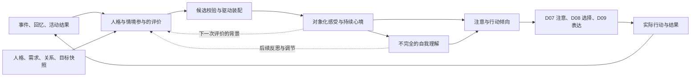

# D04 情绪与调节：总体设计稿

状态：设计草案，供用户与总装评审；尚未实现，也未完成行为或数值验收。本文不授权自动合并、发布或训练。

日期：2026-09-22。模块分支：`codex/module-d04-emotion`。起始基线：`3be5b02829cd03a1d2440aa90c2bba15bbd8853a`。所有 PR 的 base 固定为 `codex/embodiment-3-rewrite`。

范围：D04 情绪与调节。对应的跨模块边界以 [module-workstreams.md](../architecture/module-workstreams.md) 为准。共享接口与共享架构文档由总装任务 `01a0c908-2e83-7453-9d34-25628e22b8e7` 协调；本文中的新合同都是待集成提案。

## 1. 设计结论与授权范围

Sylanne 是具有持续人格、关系和生活的陪伴型智能体。D04 提供由人格和经历参与形成、可并存、可修正、随时间演化的情绪过程。其复杂性来自不同意义、关切和经验之间的相互作用，而非预先编排的情绪剧情。

用户已明确确认：

1. 人格影响情绪产生本身，并贯穿评价、演化、调节和表达；同一人格也不对应固定反应。
2. 理解对方与仍然受伤可以同时存在；接受道歉不意味着立刻释怀。
3. 内在感受、自我理解、外在表达可以不同步；自我理解可以不确定、误判和修正。
4. 情绪影响注意、判断和行动倾向，最终行为需要与人格、关系、动机及情境共同决定。
5. 即时感受、持续心境、尚未消解的情绪关切可以并存，并有不同的变化速度。
6. 调节有个体差异、有局限、可能失败，也可以随经历成长；存在元情绪。
7. 分对象、分事件、保留缘由，允许矛盾共存；不压缩成单一好感分。
8. 独立生活、目标、活动和回忆可以引发情绪，不完全围绕用户即时输入运转。
9. 新证据可以纠正判断；已经发生的感受需要经历转变，不能倒改成从未发生。
10. 不把情绪做成状态机，不以固定情绪标签和切换规则驱动行为，也不每轮临时编写心情。

用户随后授权自主完成总体设计。下文的表示方法、算子、接口、预算和验收办法是据此作出的设计选择，不能标记为用户逐项批准，也不能标记为已实现能力。

### 1.1 本稿对既有设计的明确修订

以下旧表述不再作为 D04 的实施要求：

| 原文位置 | 原设计 | 本稿替代决定 |
| --- | --- | --- |
| [机制深化稿 §5、§17、§18](../architecture/embodiment-3-mechanisms.md) | 情绪过程由状态机决定合并、分裂、结束；包含阶段与过程状态机 | 情绪采用连续演化和可修订的语义结构；合并、分裂只处理身份、来源与结构，不表示心理必经阶段 |
| [机制深化稿 §12](../architecture/embodiment-3-mechanisms.md) | 离散阶段转换作为复杂情绪的组织方式 | 不以情绪模式切换决定可调用算子；算子适用性来自证据、类型、资源与求解条件 |
| [完整组织设计 §6](../architecture/embodiment-3-ecosystem.md) | 离散阶段决定允许哪些算子；`F_mode` 组织情绪 | 使用稀疏语义评价与连续动力块；没有“愤怒阶段”“和解阶段”等运行开关 |

保留已有的共享图、来源追踪、约束进入计算、增量求解和表达合同原则。事务的候选/提交、任务的运行/取消、存储的活跃/归档属于软件生命周期，不代表情绪状态机。源文件本轮不修改，同步工作列为集成依赖 I-01。

### 1.2 非目标

本稿不重设计 D01 人格、D05 关系或 D07 认知；不替换 D06 记忆真源；不决定用户的真实情绪；不让 D04 直接发消息、调用工具或安排生活。公式只定义人工角色的计算机制，其稳定性不能证明人类心理规律或角色已经具有人的主观体验。

## 2. 总体结构

采用“有来源的语义评价 + 对象化连续感受 + 多时间尺度耦合 + 不完全自我理解 + 行动倾向读出”的组织方式。



这是依赖关系，不是一次消息必须完整走过的流水线。已有状态可以只推进时间，新的解释可以只使局部评价失效，表达可以读取已提交快照。反馈通过明确的后续事件或有时间间隔的更新发生；同一求解块中的数值耦合另由 D11 处理，不让模块递归互调。

核心单位不是“生气”，而是“某个主体面对某个对象或事项，因某种意义形成的一组持续反应”。情绪词是可修订的描述，不是内部唯一表示，也不作为行动资格的开关。

## 3. 状态所有权与身份

### 3.1 一份权威状态

所有 D04 状态写入 D11 共享图。D04 是语义与写入权限的所有者，不新建情绪数据库、关系账本或记忆库。图中的 `Owner` 表示 Bot/角色等隔离范围，模块所有权表示写权限；不能把 D04 直接当作现有 `OWNER_KINDS` 的新值。

| 内容 | 权威所有者 | D04 的使用方式 |
| --- | --- | --- |
| 身份、价值、特质、自我观、长期习得策略 | D01 | 读取版本化配置；提交成长证据或策略更新候选 |
| 精力、疲劳、压力、恢复与资源消耗 | D02 | 读取并请求预留/结算；不得复制可扣减资源余额 |
| 实体、事件、信息视角和现实性标记 | D03，来源由 D06 支持 | 只引用已解析身份与证据，不自行认定他人意图 |
| 对象化感受、心境、调节效果、对自身感受的描述假设 | D04 | 在共享图中维护；与事实信念区分 |
| 信任、亲近、边界与关系修复 | D05 | 读取并输出有来源的影响候选，不直接写关系分值 |
| 来源、历史经历、检索、修订、删除 | D06 | 引用证据包和回忆事件；提交经历记录，不另建检索链 |
| Concern、竞争解释、工作集、注意票据、反思调度 | D07 | 引用 Concern 与解释；输出情绪显著性和反思请求 |
| 目标、承诺、行动选择与执行意图 | D08 | 读取目标/承诺，提出有理由的行动倾向 |
| 表达意图编排、措辞与语言核验 | D09 | 提供感受、自我理解、披露意愿和强度边界 |
| 独立活动、生活时间推进与主动交流机会 | D10 | 消费实际活动或明确角色模拟事件，提出分享愿望 |
| 类型注册、事务、求解、预算、投递与恢复 | D11 | 通过统一合同执行 |
| 配置、诊断与角色工作台 | D12 | 提供可追溯投影，不产生第二套可写真值 |

### 3.2 三时间层不是三个独立总分

- 即时感受：绑定事件及解释的连续反应，可同时存在于多个对象和多个意义上。
- 持续心境：D04 拥有的角色范围背景过程，影响后续评价的敏感性与注意倾向；不据此给某个人分配责任。
- 尚未消解的情绪关切：D07 的 `Concern` 加上 D04 对该事项的感受、残留及关联来源。D04 不复制 Concern 的解决条件、唤醒计划或状态。

Concern 解决后，残留可以继续恢复；情绪平复后，Concern 和承诺仍可能未解决。归档仅改变计算和存储安排，不能表示原谅、遗忘或关系修复。没有持续事项的短暂欣喜无需强制创建 Concern。

### 3.3 隔离与跨会话

权威隔离键至少包含 `bot_id + persona_id`。对象绑定采用 D03 的实体引用，不能只用昵称或会话里的文本。多人、群聊、私聊场景保留受众和可见性；同一人格的私人经历可影响整体心境，但私密来源不能因此在群聊被披露。跨会话延续只在共享身份与访问合同允许时发生。

情绪过程的身份锚定于所有者、事件/事项、评价对象和意义引用。不得仅凭向量相似度合并两个人、两个事项或独立事件。合并/拆分需保留来源别名与贡献映射，不能复制驱动；若数值模型无法等价转换，则保留原块并建立关联，暂不合并。

### 3.4 三种边不能混用

当前派生结果的失效依赖、已经发生的经历之历史来源引用、数值块之间的动力耦合是三种不同关系。解释撤销会使当前派生评价失效，但历史引用仍记录当时采用过该解释，不因此抹掉已发生的经历；删除则按照删除合同遍历相关历史引用。当前 GraphStore 的失效依赖图要求无环，不能把相互耦合的感受/心境直接互设为 `GraphWrite.dependencies`。

数值耦合由 D11 在联合求解块内部表示，以前一已提交快照和外部输入为完整读集，共同输出新版本。需要 D11 协调联合块与失效图的表示以及不同边的遍历规则，不能用循环来源依赖或丢失引用来绕过现有约束。

## 4. 语义表示与合同提案

以下名称是本文的设计级合同，不表示当前仓库已有同名实现。公共命名、schema 与迁移由总装及相应所有者评审。

### 4.1 共用信封

共用信封包含：`schema_version`、隔离范围、稳定对象引用、完整输入版本、来源引用、算子/参数版本、事件幂等键、源事件时间、获知时间、角色生活时间映射、访问范围。候选携带拟处理区间；提交时间、最终序号和已提交标记只能由 D11 在成功提交时填写。模型或未提交候选不能自报已经发生的提交。源内容保持在 D06，D04 只保存必要引用及派生结果。

现实性与执行性是两个维度：对象事件可以是已观察、转述、假设、角色模拟或未知；一次情绪计算可以是实际提交、隔离模拟或未提交候选。现实运行中因设想而产生的担忧可以是真实提交的角色状态，但设想中的背叛不能变成对方真实行为。

### 4.2 主要对象

| 合同 | 最小内容 | 语义与限制 |
| --- | --- | --- |
| `AppraisalBundle` | 事件/对象引用、Concern 可选引用、人格/需求/关系/目标版本、解释引用、意义项、置信区间或未校准置信标记、反证与未知 | 同时容纳多种解释；不直接返回全体情绪状态 |
| `MeaningFacet` | 受影响的价值/目标/期待、期待来源、责任假设、可控性、预期影响、关系意义、自我意义 | 可增量修订的语义结构；维度未知不填成 0；自发期待不等于对方承诺 |
| `AffectProcess` | 稳定身份、对象/来源/意义引用、连续块引用、驱动贡献引用、Concern 关联 | 没有必须经历的情绪阶段；情绪词只存在于描述投影 |
| `FeelingBlock` | 语义基底版本、连续坐标、参数快照、时间游标、求解证据、有效输入 | 坐标含义必须可声明；不能只保存无法解释的全局向量 |
| `MoodField` | 角色范围背景块、基线引用、贡献依赖、时间游标 | 提供背景，不承担某个人的责任或某个事项的真值 |
| `SelfUnderstanding` | 关联感受快照、候选描述、候选原因、未知部分、置信度、反思来源 | D04 的感受自述假设；关于他人的事实解释仍引用 D07；不能把诊断信息全部注入角色自述 |
| `RegulationAttempt` | 策略版本、目标过程、动机、启动依据、执行回执、资源引用、预期效果、观察效果 | 尝试与效果分开；执行状态是任务生命周期，不是情绪阶段 |
| `AffectExperienceRef` | D06 经历记录引用、实际提交区间、当时解释和参数版本、资源回执 | 保存“当时确实发生过什么”的引用；不另建不可删除的情绪日志 |
| `AffectiveReadout` | 快照版本、注意/行动倾向、适用对象、理由、强度与不确定性、披露意愿 | 是选择依据，不是已选择行动；不携带发送权限 |

### 4.3 不预设固定情绪词表

“欣喜、羞愧、恼怒、安心”等词允许用于描述和检索，但不强制每一帧选择一个标签或若干基本情绪百分比。多种感受的坐标按对象和意义保持可分辨，不能先加成正负总分再生成回复。

数值系统仍需要有限、已注册且有语义的基底。初始基底可覆盖期待实现/落空、接近/保护倾向、控制感、关系相关反应和自我评价等机制，但这不是最终人格或情绪的固定维数。新增基底必须说明输入、尺度、作用和行为验收，并经版本化注册；语言模型不能即兴增加一个没有算子定义的坐标。

丰富性来自多个意义块的组合、关系及历史依赖，也来自后续可扩展的基底。新颖感受暂时无法映射时，保存有来源的语义候选并报告表示缺口，不强行映射为“中性”。

## 5. 评价如何形成

### 5.1 人格条件化的意义判断

评价读取：事件/情境、当前相关人格结构、身体需求、对象关系、当前目标与期待、D07 的竞争解释，以及 D06 提供的有权限证据包。只读取相关片段，不能每条消息展开整个人格与记忆。

语义模型可提出“这触及了什么、她如何理解、哪些解释尚不确定”。例如一次未联系可能触及分享期待，也可能仅引起挂念，或者此刻没有显著意义。系统不预先写死该事件类别应产生失落。

人格不仅改变响应强度，还改变相关性选择、期待形成、责任解释、自我评价、恢复与调节偏好。D04 不维护“外向型必开心”“敏感型必生气”这样的角色模板；同一人格在不同经历与情境下仍可产生不同评价。

### 5.2 候选校验与驱动装配

1. 校验对象、否定范围、来源、现实性及读取版本，阻止把引用、假设或未知升级成事实。
2. 保留竞争解释。互斥解释的可信权重与同一解释下可并存的多种感受分开；证据置信度也不能直接当情绪强度。
3. 同源候选作为一次评价集合装配，分配明确的贡献额度；改写同一解释、增加同义项或多轮精修不能增加总刺激。
4. 通过版本化的语义到驱动映射形成局部输入、耦合候选和读取依赖。当前意义不足以装配时明确保留未知。
5. 校验后仍只是候选；经 D11 冲突检查和数值条件验证后才提交。

这个映射包含需要校准的建模选择。来源可追踪和数值有界不能证明模型“理解得对”；验收必须分别检查语义评价、轨迹和实际读出。角色自述的原因也可能与诊断层已知驱动不同，不能用一句解释文字冒充内部因果证据。

诊断层的“已知驱动”仅表示计算实际使用过哪些输入，不把模型提出的心理原因宣称为客观真相。诊断投影同样显示来源等级、候选性质和不确定性。

### 5.3 反馈不凭空制造证据

心境可以影响下一次评价的注意与敏感性，但不能把“我很难过”用作“对方一定故意伤害”的证据。反复回忆可以带来新的真实内部反应，前提是 D07 实际安排了有时间与成本的回忆活动，D06 产生唯一回忆事件；它不增加原始事件的发生次数、独立证据量或对方责任。

## 6. 连续动力学与时间

### 6.1 选定的计算方向

总体采用可组合、受约束的非线性连续动力块；线性恢复块是其中的特例和验证基准，不作为整个情绪系统的最终表达上限。每个受影响的局部块都有语义基底、来源驱动、人格条件化参数、已提交状态及时间游标。D11 负责装配、求解与事务；D04 负责算子的情绪含义和行为方向。

一个选定的局部算子族是：

```text
dz/dt = (J - R) · grad E(z; θ) + G · u(t)
Jᵀ = -J，R = Rᵀ ≽ r_min I，r_min > 0
E(z; θ) = 1/2 · zᵀKz + Σ_l α_l log cosh(a_lᵀz)
K = Kᵀ ≽ k_min I，k_min > 0，α_l ≥ 0
```

这里 `z` 是相对当前参数版本基线的局部坐标，`u` 是有来源的事件、持续条件或实际活动驱动。`J` 表示允许的内部交换，`R` 表示恢复与时间尺度，`K` 和非线性项定义局部响应结构。它们不是人的生理常数，不用“能量”解释爱、痛苦或道德价值。

在固定参数、无外部输入的连续时间模型内：`dE/dt = -grad(E)ᵀ R grad(E) ≤ 0`。这只说明该块没有无来源的自激增长；某一坐标仍可因块内耦合暂时增强。不能把它推广为所有坐标都单调下降、现实情绪一定衰减，或整个多模块系统已经稳定。

有输入时另记录功率项 `grad(E)ᵀ G u`。有界响应要求明确 `G`、`u` 及参数的界、强制增长的势函数和固定适用区间，不能只引用无输入耗散式。事件输入需规定有限持续时间/积分剂量，或另行认证的瞬时修订算子；不能让一条消息在每个步长重新注入一份完整剂量。

参数与耦合权重有版本化上限和语义作用域。共同求解的局部块须提供共同的能量/适用域条件；不能把各块的稳定性证明直接相加当作任意耦合网络的证明。不能认证的瞬时耦合不装配；有明确行为依据的反馈可采用真正跨时间的事件合同，不能为了绕过证明随意加延迟。

### 6.2 三层时间的具体关系

即时块、对象/事项残留与心境采用不同恢复时间尺度，但不规定所有角色共用的半衰期。人格、资源及具体意义影响这些参数。对象残留对心境的投影必须保留贡献引用；心境不是把全部感受相加后覆盖原状态。

未解决事项不自动持续注入负面驱动。持续驱动必须指明正在生效的条件、有效区间、强度上界和重新核验时间；例如明确仍在等待的结果。事项退出工作集时保留状态和关联，其处理方式由 D07 注意合同决定，不能每个后台 tick 都重新经历一次。

调节改变意义输入、耦合、注意暴露或表达倾向，不直接执行“所有情绪归零”。参数/基线改变通过显式版本事件装配，记录切换前后的状态映射与能量差；固定参数的耗散结论不覆盖这类切换。

### 6.3 时间合同

| 时间或操作 | 规则 |
| --- | --- |
| 源事件时间 | 表示事情何时发生，不等于角色当时已经知道 |
| 获知时间 | 角色收到可用信息的时刻；迟到信息通常从这里产生当前反应 |
| 角色生活时间 | 由 D10/D11 的显式映射提供；不使用模型推理轮数代替 |
| 数值精修 | 同一输入、同一区间求得更准确；不再次消费事件，不增加经历时长或资源消耗 |
| 重评 | 新解释/新证据触发的语义版本变化，不等于数值迭代 |
| 离线恢复 | 推进可确定的连续过程和已授权生活活动；不能补写未实际发生的聊天、反思或成果 |
| 隔离回放 | 重建可修订的派生视图；不能覆盖真实已提交经历和已发送行动 |

幂等标识绑定来源事件、评价集合、作用对象、贡献用途和修订序列。新修订替换相应有效驱动，而非叠加一份刺激；某一来源合法影响多个不同对象时须明确各自的意义及份额。求解恢复、重复投递、回忆和修订不能共享一个含糊的“再处理一次”入口。

时间推进使用单调游标，拒绝负时间和重复区间。长离线区间按参数变化、计划活动、证据生效等边界分段，不逐条虚构后台生活。在线与离线结果应在同一事件时间线和容差下相符。计算超预算时保留未推进区间，不能把最后一帧冒充当前时刻。

### 6.4 数值与语义精度

离散积分必须另有离散耗散/误差检查；连续时间推导不自动证明某个步长或积分器可靠。具体原生求解器由 D11 评审，但实现必须声明误差容差、最大步长、局部/联合收敛条件和取消点。高精度参考解与步长收敛检查属于未来数值验收，不能用“残差很小”替代全轨迹正确性。

数值误差、时间离散误差、语义不确定性、参数不确定性分别记录。候选过期或未收敛不提交；未知语义不能靠提高数值精度解决。

## 7. 自我理解、调节与元情绪

### 7.1 感受不等于自我报告

自我理解读取获准暴露给角色反思的感受线索、记忆和经历，而不是所有诊断数据。它可以有多个原因假设，也可以只有“有些不舒服但还没想明白”。更新理解不直接重写感受；只有新评价或实际调节改变相应驱动。

外部语言不必完整披露内在状态。D09 可以实现克制、犹豫或“暂时不想细说”，但不得把私密诊断材料泄露出去，也不能让自由生成的台词回写成权威情绪。角色说“没事”不自动使感受归零；她说“我刚才很生气”也不自动证明历史状态如此。

### 7.2 调节是有成本和后果的尝试

| 机制 | 直接作用 | 不应被当作 |
| --- | --- | --- |
| 重评 | 向 D07 请求重新检视解释，采纳结果后修订意义与驱动 | 无证据地替对方找理由，或强制开心 |
| 转移注意、投入活动 | 与 D07/D10 协作改变暴露与活动输入 | 删除事件、修改关系或免除承诺 |
| 休息、恢复资源 | 由 D02/D10 确认资源及活动效果 | D04 自行补满精力 |
| 表达感受、寻求支持 | 经 D08/D09 形成候选，由实际交流结果反馈 | 只要说出口就结算为获得理解 |
| 克制表达 | 改变披露、措辞和行为读出，可伴随显式资源成本 | 内在感受已经减弱 |
| 接纳与维护边界 | 改变与感受相处、行动及关注的方式 | 必须原谅、必须继续交流 |

策略选择受人格、情境、关系、资源和以往效果影响，不维护“愤怒只能冷静、悲伤只能安慰”的映射。调节失败、反刍或短期反弹允许发生，但必须能追溯到真实活动和受限反馈，不加随机故障来制造戏剧性。

寻求用户支持是可选路径，不能成为唯一恢复条件。用户暂时离开或不愿回应时，角色仍可通过自身理解、其他获准活动及时间恢复处理感受；不把迫使用户安抚作为调节成功指标。

策略经验可在 D04 形成效果观察与改进候选；D01 拥有长期习得偏好，D06 拥有来源，D07/D08 决定是否继续尝试。一次互动或自我表扬不立即改变人格，不默认在线训练。

### 7.3 元情绪与递归限制

元情绪沿用同一评价与动力机制，其对象是自己的感受、表达或行为，不另设“二级情绪状态机”。例如羞于嫉妒，既可以与嫉妒并存，也可能让她更不愿表达。

触发必须引用已提交快照或真实行为，形成带父来源的后续评价事件。相同父事件和相同反思不得重复入账。一次调度最多展开到配置允许的深度，其余保存为 D07 待处理反思；恢复必须有后续时间/事件与预算，禁止用零时长队列持续自激。深度限制是计算预算，不代表人物心理只有两层。

## 8. 行动与表达读出

情绪输出的是具有对象、理由、不确定性和成本的倾向，例如靠近、求证、暂缓、分享、保护自身边界或照顾对方。同一份读出可以同时包含冲突倾向，不要求压成一个最大分值。

`AffectiveReadout` 至少包含：

- `feeling_refs`、`understanding_refs`、`snapshot_versions`：实际依据与自我理解分开。
- `attention_biases`、`action_tendencies`：作用对象、适用情境、连续强度或区间、理由与未知。
- `disclosure_preference`、`expression_range`：愿意透露多少、表达强度；它们不是生成好的句子。
- `evidence_limits`、`audience_scope`、`valid_until`：哪些事实不能断言、哪些来源不能公开、何时必须重算。

D07 决定注意，D08 联合人格、目标、关系和资源选择行为，D09 实现表达；D11 提供投递资格与回执。情绪不能凭一个阈值直接发消息、把期待升级成承诺，或跳过用户明确设置。主动分享愿望还须经过 D10 的时机选择和 D08 的行动选择。

表达合同至少允许“关心 + 仍有不满”“接受解释 + 需要缓一缓”等组合，但不能强制每次都口头声明所有感受。验收关注实际选择与表达的一致性，不能只看模型是否会说“我的感受很复杂”。

D09 核验读取版本、事实断言、受众权限、行动承诺和获准表达范围，不要求自述逐字等于诊断状态。忠实于 `SelfUnderstanding` 的不确定或误判自述，以及合同允许的克制表达，均可成立；不能强迫她准确说出全部感受。违反这些合同的文本应重生成或暂缓，并保留原因；不能为了让回复通过而回写一份匹配台词的情绪状态。固定模板只能作为合同测试工具，不能作为最终角色体验的替代品。

## 9. 纠错、删除与恢复

### 9.1 事实修正和情绪恢复分开

收到反证时，先使当前失效解释及其责任驱动停用，再重新评价并装配受影响输入。必须从获知反证的时点截断旧驱动，不能在等待重评期间继续注入。保留实际发生过的感受及其后续恢复过程，不把历史替换为“她从未难过”。残留不能继续为已经撤销的恶意归因提供事实支持。

示例：她因等待而失落，并曾怀疑你不在意；后来知道你遇到急事。D07 更新解释，D04 撤销对应责任驱动并保留等待产生的已提交感受，允许新的担心与释然出现；是否道歉或询问由 D08 决定。如果她之前发送了过重措辞，发送历史及责任仍存在。

| 修订目标 | 处理 |
| --- | --- |
| 当前解释、评价和派生驱动 | 失效并按新证据重建；新版本替换旧贡献 |
| 已提交的感受经历 | 保留当时版本及时间，不倒改；由新的过程继续演化 |
| 对他人的关系影响 | 向 D05 发送有依赖的修订通知，由 D05 撤销/重算对应贡献 |
| 已发送内容、已执行活动 | 保留原始结果；允许形成修复候选 |
| 未提交候选与过期读出 | 丢弃或作废，不当作经历 |
| 人格与习得策略的派生候选 | 按来源通知 D01 失效，不擅自改人格 |

非线性情况下禁止直接从当前状态减去一个“错误情绪值”。采用当前状态上的版本化修订算子，并重新计算可修订的驱动/贡献视图；若需要历史重算，只在隔离检查点分支重建这些视图。实际提交过的轨迹不会被反事实重算覆盖。修订算子不可用时撤销失效读出并等待重建，不能继续用旧责任判断。

### 9.2 删除与历史保留并不矛盾

“不倒改经历”针对普通事实修订，不凌驾于 D06 的删除合同。源记忆删除时，D04 删除或失效关联评价、内容性描述、缓存、读出和可识别来源派生物，并通知其他所有者处理依赖。只允许按共享合同保留不可还原原内容的删除凭据；不得把私人内容转移到情绪日志继续保存。

若被删除来源曾影响混合心境，必须使用有来源的重建或经评审的状态净化/重置，记录连续性损失，不假称精确撤销。来源不可分离时不能仅删除链接而继续持有可恢复的描述。删除传播未完成的状态和读出不对外服务。

### 9.3 崩溃、并发及失败

输入快照、候选写集、依赖验证、贡献去重、D06 经历记录与 D04 时间游标由同一 D11 一致提交合同保护。调节的资源支出通过跨所有者预留/结算合同完成，回执与状态、经历保持一致；外部动作另走持久化意图和结果，不放进数据库事务。

重启恢复自最后一致检查点与提交序列；重复回执、重复消息不重复刺激。两个会话同时影响同一角色心境时，按完整读集检测冲突并重装配。停机期间无法得知的外部事件保持未知，不能用“离线发生过”补造。

| 故障 | 行为 |
| --- | --- |
| 评价模型不可用或输出非法 | 保留既有状态并推进可验证的恢复；新增事件标记待评价，不当作中性 |
| 新信息已推翻旧解释，但重评暂不可用 | 立即截断失效责任驱动并停用对应读出；若无法安全重装配，冻结受影响块的待推进区间，保留无争议块推进与待处理修订 |
| 数值不收敛、证书不足、依赖过期 | 不提交；保留最后有效状态及其时间，按预算重试/续算 |
| D01/D05 等依赖缺失 | 不伪造人格/关系默认值；按合同允许的局部输入工作，否则明确等待 |
| 预算不足或取消 | 持久化待处理任务与时间区间，不能跳过后声称全量完成 |
| 发送结果未知 | 不视为对方收到、拒绝或沉默；D04 不自行重发 |

## 10. 计算预算与按需运行

所有预算由 D11 总预算管理，D04 只提供费用估计、可暂停边界、优先级依据和局部上限。具体数值需要在目标宿主测量；下表是初始实现配置提案，不是性能承诺或人物能力上限。

| 预算项 | 初始提案 | 耗尽行为 |
| --- | --- | --- |
| 当前前台评价 | 每批至多 1 次初评 + 1 次有理由的语义精修 | 保存未知/待精修，不反复模型调用 |
| 单事件竞争解释 | 优先展开至多 4 个，其余保留未展开质量/引用 | 不把未展开部分当作不存在或权重归零 |
| 单次活跃局部块 | 至多 64 块/批，按依赖组件排队 | 不任意裁开必须联合求解的块；超大组件报告预算不足 |
| 元情绪展开 | 每次至多 2 层、4 个新增评价 | 后续反思交 D07，保留去重键与父来源 |
| 记忆读取 | 只消费 D06/D07 分配的证据包及 token 上限 | 不自行扩大检索或全量载入历史 |
| 数值求解 | 消费 D11 分配的截止时间、迭代数、步长/误差配置 | 检查点续算，不把未收敛当稳定 |
| 后台与离线 | 仅处理有到期条件的任务和需要读取的连续块 | 无变化不反复调用模型，无依据不自动生成生活 |

新事件评价、修订、数值精修、回忆、后台反思分别计费和计数。记录模型调用数、token、求解耗时、活跃块规模、排队滞后与重试数。不会为了省成本将两个对象合成一个感受，或把整个角色永久压缩为少量固定维数。

## 11. 与现有代码的衔接及集成依赖

### 11.1 当前基础的使用边界

- [graph_types.py](../../rewrite/sylanne3/graph_types.py) 的 `Owner`、`AtomKey`、`TypeSpec`、图版本及快照可承载类型化状态，但新领域合同仍需注册。
- [graph_store.py](../../rewrite/sylanne3/graph_store.py)、[graph_runtime.py](../../rewrite/sylanne3/graph_runtime.py) 提供共享图与运行基础；不能据此假定完整 D04 修订/经历合同已具备。
- 当前失效依赖是 DAG；历史来源边、删除遍历与数值耦合边需要按 §3.4 分清。`TypeSpec` 也没有完整领域写者/时间/费用合同，不能把类型校验等同于本稿要求的全部授权。
- [memory_recall.py](../../rewrite/sylanne3/memory_recall.py) 提供有界回忆读取，但当前明确不提交回忆经历；本稿使用的唯一回忆事件和实际经历连接是 I-03/I-04 的待补合同。
- [operators.py](../../rewrite/sylanne3/operators.py) 已有显式读写集、延迟输入和增量作业机制；当前编译器只支持即时 DAG 与显式延迟输入，拒绝所有即时算子循环。数值 SCC 是待定义的联合求解块，不能直接写成失效依赖中的循环，也不具备本稿所需的联合非线性块验收。
- [semantics.py](../../rewrite/sylanne3/semantics.py) 的标签与双分量驱动在源码中明确是未校准 fixture；不得把它扩大成正式情绪本体，也不能作为运行回退保留。
- [native.py](../../rewrite/sylanne3/native.py) 等数值基础可用于专项验证，现有窄模型的通过记录不代表本稿的非线性耦合、连续人格情绪或真实平台已经通过。

### 11.2 交总装协调的依赖清单

| ID | 依赖与负责人 | 必须确认的输出 | 影响 |
| --- | --- | --- | --- |
| I-01 | 总装 / D11 | 共享架构中情绪状态机、阶段转换、`F_mode` 表述的替代与公共命名 | 防止后续模块按旧合同集成 |
| I-02 | D01 / D02 / D05 / D07 / D08 | 版本化人格、资源、关系、目标/期待/承诺读取，以及 D02/D07 资源预留、消耗、释放与幂等回执 | 人格条件化评价与资源结算 |
| I-03 | D03 / D06 / D07 | 实体、来源现实性、竞争解释、Concern、唯一回忆/反思事件的触发、来源去重及重投递身份 | 对象隔离、责任判断及去重 |
| I-04 | D02 / D06 / D07 / D11 | D04 类型注册、写权限、贡献修订、完整读集提交、检查点；历史来源边与失效边分离；资源回执、经历记录与时间游标一致提交及删除传播 | 持久化与纠错的可实现性 |
| I-05 | D11 | 非线性局部块、联合数值 SCC 与无环持久化依赖的映射、精度证书、取消/续算及时间合同 | 本稿动力学路线；现有基础不能直接满足 |
| I-06 | D07 / D08 / D09 / D10 | 注意偏置、行动倾向、表达合同、独立活动来源及主动机会 | 状态真正影响行为与生活 |
| I-07 | D01 / D06 / D12 | 策略成长、来源撤销、私密诊断与角色可见信息的分层 | 避免自我理解全知与越权成长 |

这些是实施前的接口依赖，不是要求用户重新设计 D04，也不是已合并的他模块承诺。在总装确定公共合同前，只能进行本模块隔离原型与合同审查；不能复制一套临时共享状态来绕开依赖。

## 12. 验收设计

本节规定未来需要执行的检查。本次文档交付不运行训练、编译或行为测试，也不沿用基线测试数量宣称这些场景已通过。

验收分四层：类型/来源/隔离；连续演化与恢复；模块合同及因果干预；纵向角色体验。数值通过不能替代语义通过，流畅台词也不能替代内部机制通过。定量阈值在实现与校准前冻结，使用独立保留场景验证，不能观察结果后再改成容易通过的目标。

| 编号 | 场景或干预 | 必须观察到的结果 |
| --- | --- | --- |
| A01 | 同一事件、不同明确人格设定，固定其他输入 | 意义选择/解释/调节可产生有根据的差异；不是仅换措辞，也不要求每个事件必有差异 |
| A02 | 固定人格，改变关系、当下资源或历史证据 | 仅相关路径变化，能追到输入；不无故改写人格 |
| A03 | 对同一人既牵挂又不满 | 两份理由和感受保持可分辨；正负相抵后不丢掉关怀或边界倾向 |
| A04 | 接受道歉或确认误解已解开 | 责任解释及时修正，残留可继续；不把道歉当清零命令 |
| A05 | 先难受，后反思出原因，再决定是否表达 | 感受、自我理解、表达有独立版本；诊断层知情不导致角色全知 |
| A06 | 克制表达、失败的重评、休息 | 表达与感受分开，资源有真实回执，失败不假结算为成功 |
| A07 | 因嫉妒羞愧、反复反思同一来源 | 允许混合元情绪；去重和深度预算生效，无零时长无限增幅 |
| A08 | 用户未发消息，但有已记录活动进展或挫折 | 能产生独立情绪及分享倾向；没有活动来源时不编造经历 |
| A09 | 迟到证据推翻“故意忽略”的解释，重评服务暂不可用 | 不将后来得知的信息倒填成早就知道；立即截断旧责任驱动并停用读出，等待期间不得继续注入；保留历史行动 |
| A10 | 重复消息、重试、精修、重启、同一回忆的重复投递 | 刺激、经历时长与资源扣费不重复；实际新回忆可影响感受但不增加原事件次数 |
| A11 | 相同事件时间线，改变求解步长/暂停点/在线离线推进 | 在预定误差限内得到一致轨迹；不同计算频率不改变人物遭遇 |
| A12 | 两对象、群聊私聊、两角色并发 | 无错绑与跨角色写入；私人情绪可影响心境但不泄露受限内容 |
| A13 | 固定输入，仅干预一个意义块或关闭一个声明的耦合 | 相关读出按声明变化，其他变化能由耦合解释；不能只检查生成文本 |
| A14 | 对照获准的误判自述/克制表达与伪造事实、越权承诺或泄露来源 | 前者按自我理解/表达合同允许，后者被检测并重生成/暂缓；不得回写状态配合台词 |
| A15 | Concern 已解决但感受未消退；感受平复但承诺未履行 | 两种情况都合法；D04 不自动关闭事项，D07/D08 不自动清空感受 |
| A16 | 删除影响过心境的来源，含重启与派生缓存 | 按删除合同失效或净化，无影子内容；不能精确恢复时明示连续性损失 |
| A17 | 模型失效、数值不收敛、超预算、并发版本冲突 | 最后有效状态不被污染；失效读出停用，待处理区间和任务可恢复 |
| A18 | 拆分/合并意义块或切换人格参数版本 | 无重复贡献、无凭空能量或历史重写；无法等价转换时拒绝或声明迁移损失 |

数值验收另需固定参数无输入的耗散检查、有界输入响应、非线性参考解对照、参数切换账目、合法耦合与越界拒绝、离散误差随精修下降。测试对象是选定算子及适用域，不宣称验证真实人类心理。

产品验收使用跨数日的独立故事线：分享期待、误解与澄清、个人项目、资源不足、关系修复、再遇相似线索。人工评审关注人物可辨认性、变化缘由、矛盾感受的自然共存、主动生活的来源和长期连续性；允许多种合理轨迹，不用唯一标准台词打分。

关键反例包括：沉默必然失落、道歉必然清零、换标签不换内在机制、反刍增添对方罪责、为了表达自然编造经历、无限元情绪、归档即原谅、求解次数越多感受越强。这些应作为拒收条件。

## 13. 实施拆分与本轮交付边界

1. 公共合同评审：总装协调 I-01 至 I-07；D04 明确公共 schema、状态归属和算子语义。同步集成分支后再开展实现。
2. 领域表示与事务：接入共享图、意义评价、贡献去重、经历引用、修订/删除和隔离；先保证编译及必要合同验证。
3. 连续数值与时间：实现局部非线性块、明确可支持的耦合、时间推进、精度与恢复。线性特例仅用于对照，不得作为完整产品验收。
4. 自我理解与调节：连接反思、资源、元情绪和策略效果，保证不会形成零时长自激。
5. 行为与生活闭环：连接 D07/D08/D09/D10，验证读出对真实选择及表达的作用，再做纵向场景。

每步只验证新增风险，不重复执行无关全量测试。旧核心与 fixture 不能恢复成正式运行回退；功能未具备时报告明确的不可用或待处理状态。

本轮交付物是本总体设计稿及面向共同集成分支的设计 PR。待评审的是公共接口名称、具体参数范围、宿主预算与数值实现路线的联合验收安排；用户已经确认的“人格贯穿、复杂持续情绪、独立生活、非状态机”方向不再作为悬而未决的问题。

本轮仅执行文档范围、链接与差异检查，以及独立设计审查。所有运行、数值、平台和纵向体验验收均尚未执行；后续手动检查按 A01—A18 场景进行，并同时查看状态来源、读出和实际表达，不能只凭聊天观感确认通过。
